# OCR常用的数据集
在这个代码仓库里，提供了常用的OCR检测和识别中的通用公开数据集的下载链接。并且提供了json标签转成.txt标签的代码和转换好的.txt标签。

# 数据集介绍
| 数据集  |    数据介绍    |     标注格式 |        下载地址 |
| ---         |     ---      |          --- |           --- |
| ICDAR_2013|语言: 英文  train:229  test:233| x1 y1 x2 y2 text  |  [下载链接](https://rrc.cvc.uab.es/?ch=2&com=downloads).  |
| ICDAR_2015|语言: 英文  train:1000  test:500|x1,y1,x2,y2,x3,y3,x4,y4,text  | [下载链接](https://rrc.cvc.uab.es/?ch=4&com=downloads).  |
| ICDAR2017-MLT| 语言: 混合  train:7200  test:1800  |   x1,y1,x2,y2,x3,y3,x4,y4,text   |  [下载链接](https://pan.baidu.com/s/1JADvSKXQ6wZ5wCgb6DYjmg). 提取码: z9ey |
| ICDAR2017-RCTW| 语言: 混合  train:8034  test:4229  |   x1,y1,x2,y2,x3,y3,x4,y4,<识别难易程度>,text  | [下载链接](https://rctw.vlrlab.net/dataset/) |
| 天池比赛2018| 语言: 混合  train:10000  test:10000      |    x1,y1,x2,y2,x3,y3,x4,y4,text    |  [检测](https://tianchi.aliyun.com/competition/entrance/231684/introduction)。 [识别](https://tianchi.aliyun.com/competition/entrance/231684/introduction) |
| ICDAR2019-MLT| 语言: 混合  train:10000  test:10000    |   x1,y1,x2,y2,x3,y3,x4,y4,语言类别,text    |  [下载链接](https://pan.baidu.com/s/1VDAvnvNvg8_SJa_vwEv5Ag). 提取码: xofo    |
| ICDAR2019-LSVT| 语言: 混合  train:30000  test:20000      |    json格式标签    |  [下载链接](https://rrc.cvc.uab.es/?ch=16) |
| ICDAR2019-ReCTS| 语言: 混合  train:20000  test:5000      |    json格式标签    |  [下载链接](https://rrc.cvc.uab.es/?ch=12&com=introduction) |
| ICDAR2019-ArT| 语言: 混合  train:5603  test:4563  |  json格式标签   |  [下载链接](https://rrc.cvc.uab.es/?ch=14) |
| Synth800k| 语言: 英文  80k    |   基于字符标注    |  [下载链接](http://www.robots.ox.ac.uk/~vgg/data/scenetext/)   |
| 360万中文数据集| 语言: 中文  360k      |    每张图片由10个字符构成    |   [下载链接](https://pan.baidu.com/s/1QkI7kjah8SPHwOQ40rS1Pw).  提取码:lu7m |
| 中文街景数据集CTW|   |   基于字符标注的中文街景图片   |  [下载链接](https://ctwdataset.github.io/) |
| 百度中文场景文字识别|  语言: 混合  32,285   |     |  [下载链接](https://aistudio.baidu.com/aistudio/datasetdetail/8429)  |
| MSRA-TD500|  语言: 中英文  Training:300  Test:200   |  .gt格式标签   |  [下载链接](http://www.iapr-tc11.org/mediawiki/index.php/MSRA_Text_Detection_500_Database_%28MSRA-TD500%29)  |
| Total-Text|  语言: 英文  Training:1255  Test:300   |     |  [下载链接](https://github.com/cs-chan/Total-Text-Dataset)  |

# 数据集标签的修正与更改
## 1.ICDAR2019-MLT
由于在ICDAR2019-MLT数据中存在着人为坐标点标错，这在训练文字检测模型计算文字区域会存在报错，所以本仓库对该数据集进行清洗并且最后到新的数据集。[ICDAR2019-MLT新](https://pan.baidu.com/s/1BR60GC3d-MqBuUm3rBKmwg). 提取码：3y8q 
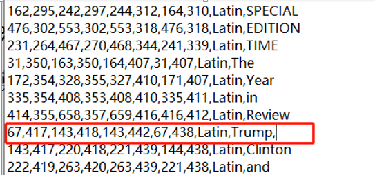
温馨提示：一、该数据集还存在着gif格式的图片，如tr_img_01674.gif，所以使用该数据集的时候需要注意读图代码的鲁棒性。
二、该数据集中还存在一些标签不规范，有的标注最后一个字符会含有','，有的没有，这会导致我们在使用split()函数对标签进行提取坐标信息和文本信息时会出现一定的错误，一定要注意。
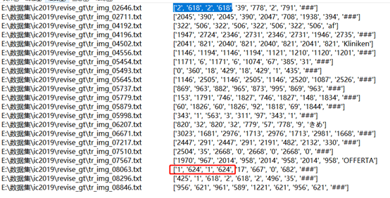

## 2.ICDAR2019-LSVT
ICDAR2019-LSVT所有图片的标签存放在一个train_full_labels.json格式文件里，在该代码仓库中运行`python3 ic19lsvt_convert_txt.py `来产生每张图片的txt格式的标签。

## 3.ICDAR2019-ReCTS
ICDAR2019-LSVT所有图片的标签都对应一个json格式文件里，如果需要txt格式的标签，可以在该代码仓库中运行`python3 ic19lsvt_convert_txt.py `。当然如果你可以修改代码第48中的`--chars`和`--lines`来得到字符级标注和基于单词级标注的txt标签。

## 4.天池比赛2018
ICDAR2019-LSVT数据标注中的坐标格式是逆时针排列，这和icdar的顺时针标注略有不同，所以如果要统一成icdar格式标注，可以在仓库中运行`python3 modify_coordinates.py `来产生。
温馨提示：由于天池数据中的图片命名后缀会有.jpg.jpg格式的情况（T1._WBXtXdXXXXXXXX_!!0-item_pic.jpg.jpg），导致可能在对图片路径或者是切分路径操作过程中会产生bug，所以建议先给该数据集修改名字，之后在进行使用。
修改名字的代码可以运行`python3 revise_name.py `
以下链接是我对天池数据做了清洗修改后的链接，可以直接下载使用。[下载链接](https://pan.baidu.com/s/1e3gzOMeWHGS3jmbJlm2PgQ). 提取码：fere

# 数据集介绍
## 1.ICDAR-2013
- **数据简介**：该数据集由462（训练229，测试233）张英文标注的自然场景图片构成，标注形式为两点水平标注，坐标格式为左上角，和右下角：
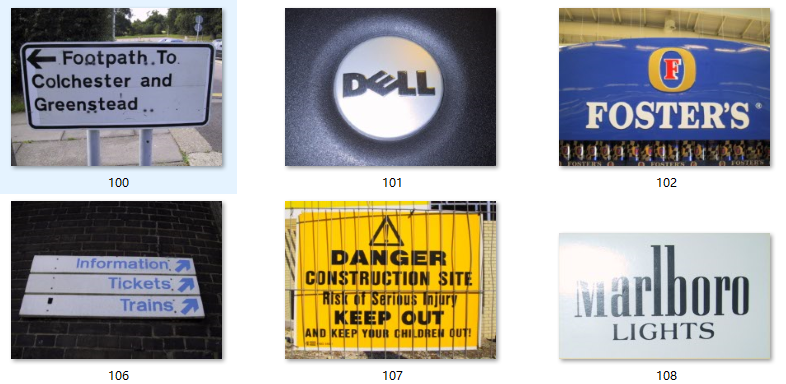

## 2.ICDAR-2015
- **数据简介**：该数据集由1500张（训练1000，测试500）英文标注的自然场景图片构成，标注形式为四点标注，坐标格式依次为为左上角，右上角，右下角和左下角，如下图所示：

## 3.ICDAR2017-MLT
- **数据简介**：该数据集由9000张（训练7200，测试1800）多种混合语言标注的自然场景图片构成，标注形式为四点标注，坐标格式依次为为左上角，右上角，右下角和左下角，如下图所示：
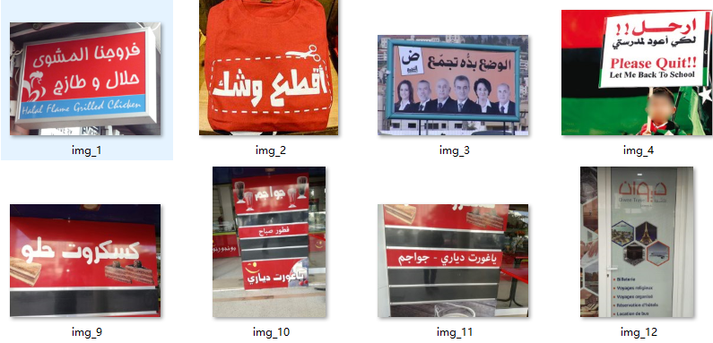

## 4.ICDAR2017-RCTW
- **数据简介**：ICDAR 2017-RCTW(Reading Chinest Text in the Wild)，由Baoguang Shi等学者提出。RCTW主要是中文，共12263张图像，其中8034作为训练集，4229作为测试集，标注形式为四点标注，
数据集绝大多数是相机拍的自然场景，一些是屏幕截图；包含了大多数场景，如室外街道、室内场景、手机截图等等。

## 5.天池比赛2018
- **数据简介**：该数据集全部来源于网络图像，主要由合成图像，产品描述，网络广告构成。每一张图像或者包含复杂排版，或者包含密集的小文本或多语言文本，或者包含水印，典型的图片如图1所示：
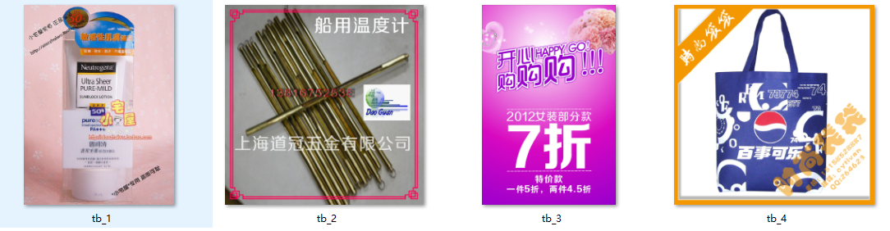

## 6.ICDAR2019-MLT
- **数据简介**：该数据集由20000张（训练10000，测试10000）多种混合语言标注的自然场景图片构成，标注形式为四点标注，坐标格式依次为为左上角，右上角，右下角和左下角
10,000个图像在训练集中排序，使得：每个连续的1000个图像包含一种主要语言的文本（当然它可以包含来自1种或2种其他语言的附加文本，全部来自10种语言的集合）
00001 - 01000 ：Arabic 
01001 - 02000：English 
02001 - 03000：French 
03001 - 04000：Chinese 
04001 - 05000：German 
05001 - 06000：Korean 
06001 - 07000：Japanese 
07001 - 08000：Italian 
08001 - 09000：Bangla 
09001 - 10000：Hindi
如下图所示：
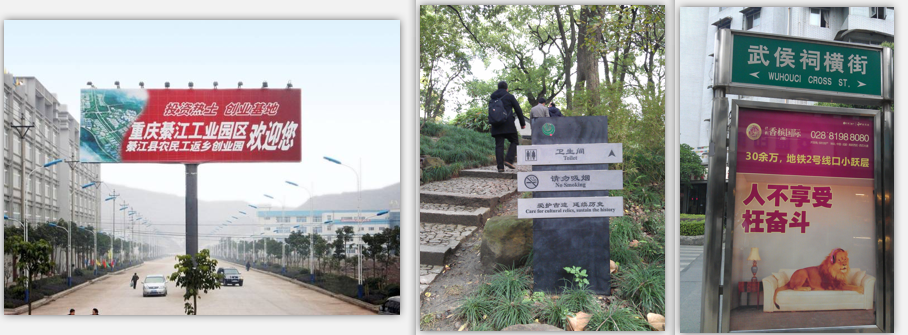

## 7.ICDAR2019-LSVT
- **数据简介**：该数据集由45w中文街景图像，包含5w（2w测试+3w训练）全标注数据（文本坐标+文本内容）构成，40w弱标注数据（仅文本内容），标注形式为四点标注，如下图所示：
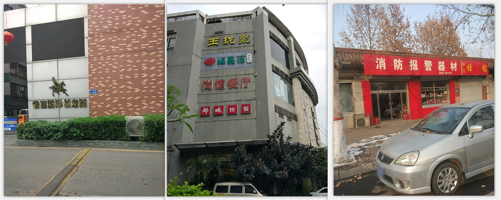

- **说明**：其中，test数据集的label目前没有开源，如要评估结果，可以去官网提交：https://rrc.cvc.uab.es/?ch=16

## 8.ICDAR2019-ReCTS
- **数据简介**：ReCTS数据集包括25,000张带标签的图像，训练集包含20,000张图像，测试集包含5,000张图像。这些图像是在不受控制的条件下通过电话摄像机野外采集的。它主要侧重于餐厅招牌上的中文文本。
数据集中的每个图像都用文本行位置，字符位置以及文本行和字符的成绩单进行注释。用具有四个顶点的多边形来标注位置，这些顶点从左上顶点开始按顺时针顺序排列。如下图所示:

## 9.ICDAR2019-ArT
- **数据简介**：该数据集共含10,166张图像，训练集5603图，测试集4563图。由Total-Text、SCUT-CTW1500、Baidu Curved Scene Text (ICDAR2019-LSVT部分弯曲数据) 三部分组成，包含水平、多方向和弯曲等多种形状的文本。
如下图所示：
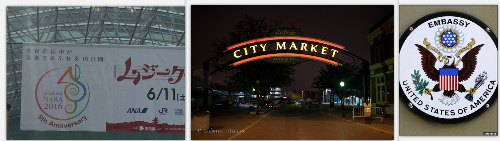

## 10.Synth800k
- **数据简介**：SynthText 数据集由牛津大学工程科学系视觉几何组于2016年在IEEE计算机视觉和模式识别会议(CVPR)上发布。
数据集由包含单词的自然场景图像组成，其主要运用于自然场景中的文本检测，该数据集由 80 万个图像组成，大约有 800 万个合成单词实例。
每个文本实例均使用文本字符串、字级和字符级边界框进行注释。
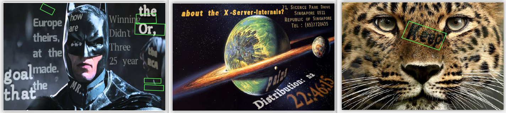

## 11.360万中文数据集
- **数据简介**：该数据集利用中文语料库（新闻 + 文言文），通过字体、大小、灰度、模糊、透视、拉伸等变化随机生成共约364万张图片，按照99:1划分成训练集和验证集。
包含汉字、英文字母、数字和标点共5990个字符（字符集合：https://github.com/YCG09/chinese_ocr/blob/master/train/char_std_5990.txt ）
每个样本固定10个字符，字符随机截取自语料库中的句子，图片分辨率统一为280x32。如下图所示：
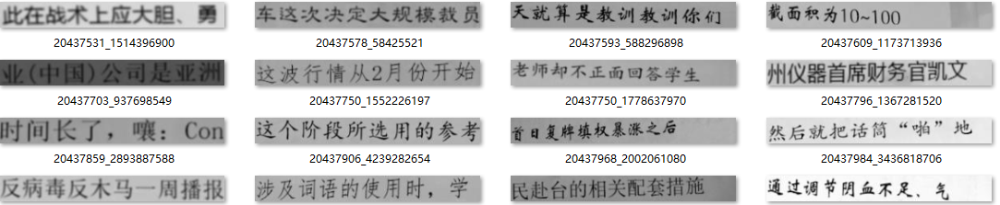

## 12.中文街景数据集CTW
- **数据简介**：该数据集包含32285张图像，1018402个中文字符(来自于腾讯街景), 包含平面文本，凸起文本，城市文本，农村文本，低亮度文本，远处文本，部分遮挡文本。
图像大小2048x2048，数据集大小为31GB。以(8:1:1)的比例将数据集分为训练集(25887张图像，812872个汉字)，测试集(3269张图像，103519个汉字)，验证集(3129张图像，103519个汉字)。
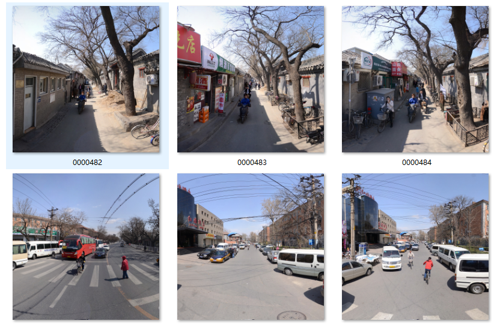

## 13.百度中文场景文字识别
- **数据简介**：ICDAR2019-LSVT行识别任务，共包括29万张图片，其中21万张图片作为训练集（带标注），8万张作为测试集（无标注）。
数据集采自中国街景，并由街景图片中的文字行区域（例如店铺标牌、地标等等）截取出来而形成。所有图像都经过一些预处理，将文字区域利用仿射变化，等比映射为一张高为48像素的图片，如图所示：

## 14.MSRA-TD500
- **数据简介**：总共500张自然场景图片(Training:300 + Test:200)。
数据集特点：多方向文本检测、大部分文本都在引导牌上、分辨率在1296x864到1920x1280之间、包含中英文、标注以行为单位，而不是单词、每张图片都完全标注,难以识别的有difficult标注。

## 15.total-text
- **数据简介**：总共500张自然场景图片(Training:1255 + Test:300)。
数据集特点：Total-Text是最大弯曲文本数据集之一-ArT（任意形状文本数据集）训练集中的一部分。用于关于任意形状文本识别阅读任务的创新想法研究。
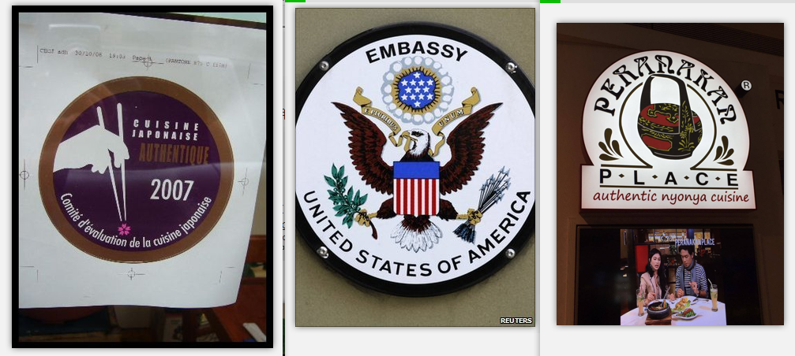
该代码仓库中运行`python3 total-text_icdar.py `可以将total_text标注的转换成icdar数据标注格式的txt标签

# Contact
Feel free to contact me if there is any question:  
My mail address is jhsignal@126.com; 
